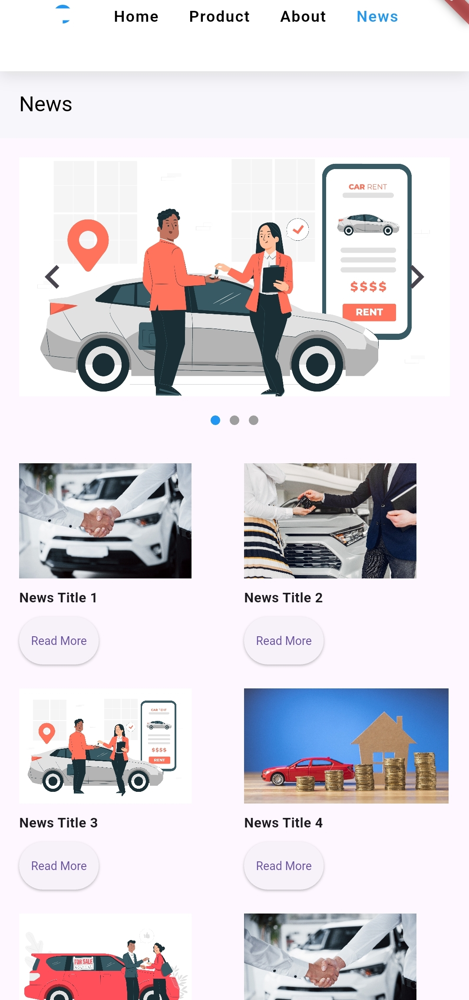

# 🚀 My First Flutter UI Project

Proyek ini adalah implementasi dari materi *Pertemuan 2 - Building Your First Flutter UI*. Tujuannya adalah membangun antarmuka pengguna pertama menggunakan Flutter dengan memahami konsep dasar seperti widget, layout, serta fitur pengembangan seperti *hot reload* dan *hot restart*.

## 📸 Preview Antarmuka





## 📋 Fitur Proyek

- ✅ Pembuatan proyek Flutter baru
- ✅ Implementasi `main()` dan `MaterialApp`
- ✅ Penggunaan `StatelessWidget` dan `StatefulWidget`
- ✅ Layout dasar menggunakan `Container`, `Row`, `Column`, `Padding`, `SizedBox`, dan `Expanded`
- ✅ Eksplorasi fitur *Hot Reload* dan *Hot Restart*

## 🛠️ Struktur Folder

```plaintext
lib/
├── main.dart       
└── widgets/           
└── screens/
```

## 🚧 Cara Menjalankan Proyek

1. **Clone repositori** ini:
   ```bash
   git clone https://github.com/ahmaddery/day2.git
   cd day2
   ```

2. **Jalankan di emulator atau device:**
   ```bash
   flutter pub get
   flutter run
   ```

3. **Gunakan fitur Hot Reload** saat mengembangkan:
   - Tekan `r` di terminal (jika dijalankan via CLI)
   - Klik 🔄 ikon petir di IDE (jika menggunakan VSCode/Android Studio)

## 🎯 Tujuan Pembelajaran

- Memahami cara membuat proyek Flutter
- Mengerti perbedaan `StatelessWidget` dan `StatefulWidget`
- Membuat UI menggunakan widget layout dasar
- Mempraktikkan *Hot Reload* dan *Hot Restart* untuk efisiensi dev time

## 📚 Sumber Materi

Materi ini didasarkan pada modul **"Pertemuan 2 - Building Your First Flutter UI"** oleh **Wandy Purnomo**.
